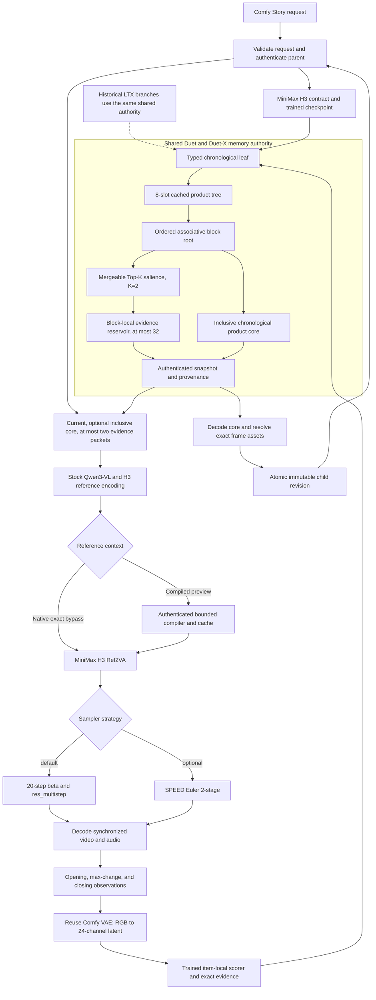

# Comfy Story — internal alpha

**Comfy Story brings named references, creator-approved visual evidence, immutable revisions, and
completed-shot recovery to MiniMax H3 in ComfyUI.** This is an internal alpha for existing compatible
H3 installations. Reference selection does not guarantee rendered character consistency.

New installations use an exact RGB reference archive without a Duet training checkpoint. It reuses
canon, evidence selection, immutable revision identities, and completed-output recovery. It does
not claim learned compression or improved H3 quality. Existing trained-memory installations retain
their configured runtime. The inspected internal H3 checkpoint has a zero history-residual readout: associative state is
accumulated, but learned history improvement is not demonstrated. Exact reference conditioning is
the current useful path. See the repository quickstart and release record for acceptance evidence.

The current **Comfy Story** node is MiniMax-only and includes selective historical recall,
creator-confirmed canon, and optional H3 reference compilation without changing the green Story
State wire or the three outputs. The former `DuetStoryCanon` ID is registered only as a deprecated
compatibility alias for already-saved internal workflows; do not add it to new workflows.
Known 8-, 10-, and 12-widget alpha layouts are migrated by field meaning when their workflows
load, so inserting the compiler and Living Canon controls cannot shift a saved world, prompt,
duration, sampler, or memory action into the wrong input.

## Install

Extract the internal ZIP on the Comfy host, then run its installer with ComfyUI's Python:

```bash
python install.py --comfy-root /path/to/ComfyUI --check-only
python install.py --comfy-root /path/to/ComfyUI
```

The installer verifies the bundle and installs Duet with `--no-deps`, so it cannot replace the
host's PyTorch/CUDA build. The native reference archive does not import LTX or load a Duet memory
checkpoint. For new projects, configure the service before restarting ComfyUI:

```bash
DUET_STORY_ROOT=/absolute/path/to/duet-story-projects
DUET_STORY_MEMORY_RUNTIME=native-reference
```

Use **Native** reference context. The archive records opening, maximum-change, and closing RGB
observations, full-resolution last frames and exact saved output bytes. Evidence becomes pending
until the creator approves it; generation cannot approve its own state. The 128-shot archive has
no dense scene core, learned salience model, or latent observations.

Existing trained projects and optional compiler experiments use the compatibility configuration:

```bash
DUET_STORY_ROOT=/absolute/path/to/duet-story-projects
DUET_STORY_MEMORY_RUNTIME=trained
DUET_STORY_MINIMAX_CHECKPOINT=/absolute/path/to/duet-x-minimax-h3-trainable.pt
DUET_STORY_MINIMAX_CHECKPOINT_SHA256=<checkpoint-file-sha256>
DUET_STORY_MINIMAX_FOUNDATION_SHA256=<frozen-training-foundation-sha256>
DUET_STORY_MINIMAX_VAE_SHA256=<minimax-video-vae-sha256>
DUET_H3_COMPILER_CHECKPOINT=/absolute/path/to/duet-x-h3-reference-compiler.pt
DUET_H3_COMPILER_CHECKPOINT_SHA256=<compiler-checkpoint-file-sha256>
DUET_H3_COMPILER_CACHE=/absolute/path/to/compiled-reference-cache
```

When `DUET_STORY_ROOT` is omitted, storage defaults to `duet_story` inside this ComfyUI
installation's configured user directory. An explicit value must be an absolute local path.
Blank or relative values fail instead of silently selecting another project store. There is no
Forge-specific storage fallback. If an existing installation relied on the old default, set
`DUET_STORY_ROOT` to its existing directory before upgrading; stored projects are not moved.

When the mode is omitted, an existing `DUET_STORY_MINIMAX_CHECKPOINT` keeps the trained runtime;
otherwise the native archive is selected. Native and trained revisions cannot be silently converted.
Use the original runtime and story store for existing projects.

The trained runtime checkpoint must use contract `duet-x-minimax-h3-v1`, contain the trained 24-channel bridge and
scorer, and record all 2,000 optimizer steps. This repository deliberately includes
no training checkpoint. It also includes no model weights, dataset, or generated evidence. Unit
tests use deterministic fake codecs and fixture weights; those fixtures are not valid for a real
Story run.

LTX is a compatibility memory backend, not a MiniMax dependency. To open or extend an existing LTX
branch, install `OpenImageIO==3.1.16.0`, expose the authenticated LTX package roots, and configure
the historical variables:

```bash
PYTHONPATH=/path/to/LTX-2/packages/ltx-pipelines/src:/path/to/LTX-2/packages/ltx-core/src:/path/to/LTX-2/packages/ltx-trainer/src
DUET_STORY_CHECKPOINT=/absolute/path/to/the/frozen/duet-x-trainable-checkpoint.pt
DUET_STORY_SOURCE_COMMIT=<40-character deployed source commit>
DUET_STORY_SOURCE_ARCHIVE_SHA256=<deployed source archive sha256>
```

The legacy checkpoint path and both source identities are required explicitly. Missing paths,
missing provenance, and all-zero source identities fail before generation. No research-run path
or placeholder source revision is supplied automatically; checkpoint authentication stays intact.

The ComfyUI service account must be able to traverse and read the configured checkpoints and model
directories. When an LTX checkout belongs to another account, add that exact path—not a wildcard—as
Git `safe.directory` for the service account.

Required models are not included in the ZIP:

- `minimax_h3_ref2va_pruned_int8_convrot.safetensors`
- `qwen3vl_32b_minimax_h3_nvfp4_awq.safetensors`
- `minimax_h3_video_vae_fp16.safetensors`
- `minimax_h3_audio_vae_fp32.safetensors`
- official LTX `ltx-2.3-22b-dev.safetensors` only for LTX memory, SHA-256
  `7ab7225325bc403448ea84b6db2269811a880e5118cd2ee2b6282a93d585016f`
- frozen Duet-X trainable checkpoint, SHA-256
  `c40a90d38319ed4019b79ebc0b175c9a8f094dcc007d375ad8397ca1cd18a30f`

## Make a story

Add **Comfy Story** from **Comfy / Story**. Name the project, add as many shared image references as
needed, give each a memorable name and role, and describe what matters in its note. A MiniMax shot
selects up to seven named images with `@mentions`; the remaining library stays available to later
shots. Living Canon keeps at most two recalled identity/state packets exact and routes additional
selected references into the compiler's dense common-structure lane. A Motion reference can reduce
the available image roster by one when an inherited core is also active. For example:
`@Maya opens @WoodenChest as wind moves her asymmetric red scarf.`

Choose the starting frame and click **Run workflow**. The node returns a finished 1344×768,
24-fps clip with native audio, its last frame, and the shared Story State. Click **Add Next Shot**
to create another Comfy Story node with both required wires already connected. Edit only the intent,
direction, active mentions, duration, or Variation, then generate again.

The four intents are:

- **Start Story** — establish the world: `@Maya finds @WoodenChest on the coast.`
- **Continue This Shot** — extend composition and motion: `@Maya slowly opens @WoodenChest.`
- **Next Shot** — change the camera while retaining the story: `Close-up of @Maya studying the mark.`
- **New Scene** — provide a new starting frame but retain named identity: `At dawn, @Maya carries @WoodenChest into the market.`

For a cut to a new camera setup, choose advanced **Composition → New composition**. This keeps
native H3 references and selected historical evidence, while removing the first-frame latent guide
and the inherited inclusive scene image. Saved associative state is retained. **Continue frame** remains
the default for existing workflows. Reference selection still needs visual review. See the
[film production workflow](../../docs/DUET_STORY_FILM_WORKFLOW.md) for screenplay causality,
reviewed take selection, authored language, and exact timeline export.

To branch, connect two child Comfy Story nodes to the same parent's Last Frame and Story State.
Each take becomes an immutable child; neither changes the parent or the other take.

For exact narration, connect a reviewed Comfy AUDIO track to **Authored audio**. It replaces H3's
generated soundtrack and is included in the shot's recovery identity. Shorter audio is padded with
silence; overlong, nonfinite, clipped, or unsupported batch/channel inputs fail before generation.
This supports approved recordings and upstream TTS workflows; it does not generate lip sync or
verify pronunciation. Provide each shot's own audio while retaining the chosen voice configuration.

### Reference context preview

**Native** sends the selected visual roster through stock MiniMax H3 unchanged. **Compiled preview**
reduces the MiniMax reference context sent through generation and keeps up to two selected identity
or product details exact. Mention an asset in the shot prompt, then click its active chip to mark
**keep exact**. A connected Motion reference is treated as a silent ordered visual source.

Compiled preview is an internal preview until its speed, memory, and quality gates are complete. It
does not claim lower VRAM or faster generation yet. The visible node never exposes experimental
method names: the authenticated compiler and cache operate behind Comfy Story, while MiniMax H3,
Qwen3-VL, both VAEs, sampling, and audio generation remain stock.

The current node and deprecated workflow alias use the same reference-context seam. The compiler
receives the current frame, an optional inclusive chronological core, at most two query-selected exact
evidence packets, and then any remaining explicitly mentioned references within the bounded
roster. Evidence packets are marked protected at the compiler boundary, so integrating the
compiler does not erase Living Canon's exact-exception policy.

The public Native path presents original identity and current-state evidence as separate images,
with state precedence stated explicitly. It never presents a baseline/state contact sheet to H3.
The same saved packet remains available for historical replay and experimental Compiled preview.
The limit is still two recalled packets and nine total image/motion sources; separate sources
consume real slots and excess demand fails instead of silently dropping approved state.

This is still a reference-conditioning implementation, not the proposed model-native 256-row
memory prefix described in the MiniMax architecture research. That next backend requires an
exact-off packed-layout canary, scoped entity/time routing, and trained H3 LoRA before it can replace
the current path. The durable Story State, associative cache, canon, evidence, and revision
contracts are intentionally reusable by that future backend.

The Story Library can hold many reusable assets, but each shot has a selected semantic roster of at
most nine visual items. MiniMax H3 still generates one 5–15 second shot per call. Long-form projects
remain a chain of inspectable shots assembled by the workflow; compiled reference context remains experimental and does not turn H3 into a single ten-minute
denoising pass.

The first revision locks the branch to its storage runtime and model configuration. Native archives
bind their versioned runtime fingerprint instead of a checkpoint. Trained revisions additionally
lock their backend, contract, trained memory checkpoint, and
model-memory configuration. Continuing a MiniMax branch as LTX—or an LTX branch as MiniMax—fails
before the generation graph is built. Changing only the sampler is allowed because sampling does
not reinterpret cached memory. Changing memory backend requires a new branch rebuilt from
authoritative frame evidence; cached operators are never converted between latent spaces.

## Living Canon behavior

In the trained runtime, each completed Living Canon shot remains one ordered Duet leaf, but that leaf contains two or
three exact observations: opening, maximum visual change when one exists, and closing. Every
observation records its decoded frame index, cumulative timeline interval, full-frame q16
geometry, content digest, backend fingerprints, salience, and source evidence. This fixes the old
final-frame-only and mixed-duration provenance gaps without consuming extra global shot slots.

The persistent state and active MiniMax roster are deliberately different:

| MiniMax role | Content |
|---|---|
| current | Previous frame or new-scene starting frame; frame-zero guide in Continue frame mode |
| inclusive-core | Chronological Duet core when history exists; omitted for public New composition cuts |
| evidence-1 | First relevant approved identity or authenticated historical state packet |
| evidence-2 | Second relevant packet, only when one is justified |

Sixteen cached eight-shot blocks still provide 128-shot capacity. Each block retains its local
Top-2, producing a bounded reservoir of at most 32 important moments. Query-time recall chooses at
most two packets. Approved evidence is resolved from the durable registry even when absent from this bounded
reservoir. Forget tombstones replace affected dense leaves with identity in subsequent state.
The stored core otherwise remains inclusive, so selecting exact evidence does not remove its leaf. The
exclusion-aware Duet-X implementation remains available for research and v2 loading.

`Automatic` honors explicit `@mentions`, then considers only creator-confirmed canon marked
`present`. `Prompt mentions only` leaves unused evidence capacity empty. Remembered, relevant, and
present are separate: off-screen canon stays remembered but is not injected unless explicitly
mentioned or selected with **Use in this shot**.

Generated pixels and prompt text create reviewable pending observations; they never silently
change canon. The panel exposes these value-oriented controls:

- **Keep @Name look** confirms one entity's generated appearance and retains its exact
  supporting frame in one action. This is the normal choice for a changed costume, damaged prop,
  or other state that must return after a long absence.
- **Keep this detail** retains exact evidence inside the bounded policy without changing canon.
- **Use in this shot** places eligible evidence first in the next recall decision.
- **Update canon** is the underlying authenticated state transition used by **Keep @Name look**.
- **Restore original** selects the approved Story Library baseline.
- **Let fade** removes a retention pin while ordinary core history remains.
- **Forget** writes a branch-local tombstone; the immutable parent remains recoverable.

Panel actions on a completed shot are staged for its next child. Use **Add Next Shot** to transfer
them; the parent's generating inputs remain unchanged. Use **New take** to change variation, and
save the workflow to retain graph/draft state. Identical completed inputs recover stored outputs
before a generation graph is constructed; interrupted unfinished sampling is not resumable.

Every v3 revision binds the exact guide tensors and recall decision in a generation receipt. A v2
MiniMax parent migrates conservatively: approved references become baseline canon and exact legacy
guide images remain evidence, while unavailable entity, frame, and time facts stay unknown. LTX v1
state remains unchanged and is not silently converted.

For a deterministic product smoke, establish Maya with a pristine BrassKey, generate the key
bending, confirm that pending state as `bent`, leave both off-screen for later shots, then mention
`@Maya` and `@BrassKey`. The inspector should list exact recalled evidence under **Used for this
shot**. Real quality evidence requires actual H3 output and independent review. Native reference
archives need no memory weights; trained-runtime evaluations require authenticated trained weights.
Test fixtures are not valid visual acceptance evidence.

## What the trained compatibility memory does

Duet is shared across both memory backends. The adapter changes the latent vocabulary—24 channels
for MiniMax H3, 128 for historical LTX—but it does not create another fusion algorithm, cache,
Top-K selector, snapshot implementation, or Story store. Every completed shot becomes one ordered
leaf. Sixteen authenticated eight-shot blocks provide 128-shot capacity; a sparse update recomputes
one product-tree path rather than rebuilding full history.



Combination is chronological and non-commutative, while reassociation remains valid: centralized,
balanced, and hierarchical groupings represent the same ordered product up to floating-point
tolerance. Living Canon includes every non-forgotten leaf in the dense core; query-relevant observations also
bypass compression as authenticated exact frame packets. This controlled duplication is safer
than silently losing an event when different prompts select different evidence.

The MiniMax adapter reuses the video VAE object already loaded by Comfy for generation. Only the
Duet bridge/fusion, item-local scorer, and gated/resampler evaluation controls are trainable.
MiniMax H3, Qwen3-VL, and both VAEs stay frozen. Existing LTX weights cannot be reused because their
latent width and learned interpretation differ.

The model-dependent seam is deliberately narrow: backend identity, frame encode/decode, bridge,
and item-local score. This keeps the model replaceable without generalizing the shared tree or
revision system into a plugin framework. FastH3 preview is not wired in this phase because its
released path is T2VA while Story continuity requires MiniMax H3 Ref2VA ordered references.

This alpha builds the chain manually so creators can inspect and redirect every shot. Automatic
screenplay expansion, timeline stitching, transitions, music mastering, and one-click ten-minute
rendering are the next product layer; they should reuse this same chain and state rather than create
a second memory system.

## Troubleshooting

- **Mention a reference**: use exact names shown in the library, such as `@Maya`.
- **Unknown reference**: correct the spelling or add it to the shared library.
- **Too many exact state packets**: reduce this shot to two exact requests. Retention pins and
  per-shot exact selection have different budgets.
- **Compiled preview requires two visual sources**: mention at least one library asset; the current
  or starting frame is the other source.
- **Start Story requires World / starting frame**: upload or select the opening image.
- **Continue This Shot requires Previous Frame**: use Add Next Shot or connect Last Frame manually.
- **Requires Previous Story**: use Add Next Shot or connect the green Story State output.
- **Connected state does not match recovery revision**: clear the advanced recovery value or load
  the matching workflow revision.
- **Missing/corrupt revision, asset, or checkpoint**: restore the configured storage/checkpoint;
  the node refuses to guess or silently reset history.
- **Capacity reached**: start a new volume after 128 shots.

Removing the custom node does not delete story projects. They live under `DUET_STORY_ROOT`. Back up
that directory before removing it; deleting it permanently removes revision history and references.

Both included two-shot workflows use the current MiniMax-first dual-wire layout. Older saved alpha
workflows are upgraded in the browser from their known positional widget layouts when loaded.

## Optional MiniMax H3 SPEED sampler

`Native res_multistep` is the default and keeps the built-in 20-step beta schedule with
`res_multistep`. For local, noncommercial evaluation, `SPEED Euler 2-stage` can use the externally
installed [ComfyUI-MiniMax-H3-SPEED](https://github.com/StanLukuvka/ComfyUI-MiniMax-H3-SPEED)
node. Duet does not vendor, download, or silently substitute this dependency. Its code is licensed
under **PolyForm Noncommercial 1.0.0**; verify that restriction fits the intended local use.

Install the repository under `ComfyUI/custom_nodes/`, restart ComfyUI, then run its **Sigma Harvest
(Native Euler)** workflow once for the exact pruned INT8 ConvRot checkpoint and any LoRAs or other
model patches. The current Duet preset uses the repository's published base-H3 calibration:
2 stages, `direct_coarse`, delta `0.01`, amplitude `7.394`, decay exponent `0.62`, and seed offset
`10000`.

Selecting SPEED changes only how MiniMax samples the next clip. It does not change the MiniMax
latent memory contract, Duet combinators, cached operators, Top-K exceptions, checkpoint identity,
or branch compatibility. If `MiniMaxH3SPEEDSampler` is absent or its required input schema changes,
the Story node fails before constructing the generation graph; it never falls back silently.


### Turbo preview sampling

With **Render profile → Reference shot**, **Sampler → Turbo 4-step** selects the MiniMax H3
Ref2VA Turbo LoRA with four Euler steps,
simple scheduling, video/audio shifts 12/3, and `match` reference resizing. Install
`minimax_h3_ref2v_turbo_4step_v0.1_comfyui_bf16.safetensors` under `models/loras`;
Comfy must provide `MiniMaxH3SigmaShift` and `LoraLoaderModelOnly`. No SPEED plugin is needed.
The output remains 1344×768. Turbo's training resolution is 544p, so speed and output quality
must be evaluated separately. Native 20-step sampling remains the default. Execution receipts
bind the Turbo configuration and actual LoRA SHA-256; memory checkpoint identity is unchanged.
See the [film runner guide](../../docs/DUET_STORY_FILM_WORKFLOW.md#faster-iteration-with-minimax-h3-turbo).


With **Render profile → Animate frame**, **Sampler → Turbo 8-step**
uses `minimax_h3_fl2v_turbo_8step_v1.0_comfyui_bf16.safetensors` in `models/loras`,
strength 1, eight `res_multistep` steps and `simple` scheduling, with the model's default
sigma shifts. It needs `LoraLoaderModelOnly` and the same FL2VA base model as native Animate
frame. This existing configuration is unchanged.

With **Render profile → Reference shot**, Turbo 8-step instead uses
`minimax_h3_ref2v_turbo_8step_v1.0_768p_comfyui_bf16.safetensors` with the Ref2VA base model,
strength 1, eight Euler/simple steps, video/audio shifts 12/3 and `match` reference resizing.
The reference adapter targets 768p; successful execution does not establish a quality advantage.
Missing weights fail before rendering; there is no silent adapter or sampler fallback.

Choose it in the Story node's Sampler control or the film editor's Advanced shot settings.
Seeds remain explicit, and execution receipts bind the actual adapter bytes. Changing this
sampler creates a different generation identity; using the same seed across samplers does not
promise the same pixels. Native remains the default. A successful short development example
is not evidence that Turbo improves story coherence or long-film quality.

### NVFP4 Exact and Balanced (experimental)

**Sampler → NVFP4 Exact** runs the public
[`lilcheaty/MiniMax-H3-NVFP4`](https://huggingface.co/lilcheaty/MiniMax-H3-NVFP4)
Ref2VA transformer with 27 Euler updates, simple scheduling, and video/audio shifts 12/3.
**NVFP4 Balanced** adds bounded first-block residual probing and first-order tail prediction,
inspired by the [Ultra Fast Space](https://huggingface.co/spaces/mrfakename/minimax-h3-ultra-fast/tree/5620192d2087ce79a0a8ffdcc5e940da0be9560a).
The first three and last two updates are dense. At most two consecutive updates reuse the block
tail when its first-block relative residual change is at most 0.08. Native Comfy conditioning,
reference ordering, frame-zero guides, output heads, and synchronized audio remain in place.
The cache resets on every sampling attempt, including failures; it is not Story memory.

Install `minimax_h3_ref2va_pruned_nvfp4.safetensors` under `models/diffusion_models` on a Blackwell
GPU with CUDA 13 and a ComfyUI build supporting native H3 NVFP4 and block replacement hooks.
Start ComfyUI with `--disable-comfy-compiler` for Balanced: its changing allocation pattern is
incompatible with the allocation compiler. The node checks this before sampling.
The tested download revision is `8c5abfed61e1b6a170240792b65253fba1a65b7b`. The model is not
bundled. Do not install the Space's requirements into ComfyUI. This integration uses the installed
Comfy kernels. These Exact and Balanced modes retain dense attention and do not use the Space's
aggressive whole-output forecast; the additional Sol-Attn mode is described below. Its schedule uses Comfy's simple grid, not the Space's Diffusers scheduler, so this is
not a bitwise reproduction of the Space. Neither mode uses a Turbo LoRA. Exact means no block
reuse, not original full-precision weights.

Both modes remain 1344×768 and preserve the selected reference context and Composition controls.
Their inference configuration and actual NVFP4 file SHA-256 are bound into the execution receipt,
so switching modes or changing weights cannot recover a clip from another configuration. The
trained memory checkpoint, training-foundation identity, video VAE, chronological tree, and
historical snapshot interpretation remain unchanged. The NVFP4 generation model is an explicit
inference approximation, not a replacement or relabeling of the memory checkpoint's training
foundation. Native and Turbo recovery keys remain unchanged.

Compare Exact and Balanced on the same prompt, seed, references, and shot length before choosing
Balanced for a project. Comfy's server log reports actual dense/cached update counts. Cache hits
are workload-dependent; four-bit weights and predicted tails can affect motion and reference
fidelity. Existing Native and Turbo modes remain available, and Native remains the default.
Model weights retain the MiniMax H3 Community License. The cache is a native implementation of
the first-block/tail method; no Space application or transformer code is bundled.

### Complete accelerated H3 options

`NVFP4 Ultra Fast` combines the native NVFP4 checkpoint and Balanced block cache with
NVIDIA Sol-Attn's portable Triton backend. It follows the linked Space's **Ref2VA** policy:
27 Euler updates; the first ten updates and first two layers retain dense attention.
Sequences shorter than 24,576 tokens also retain dense attention. Only the generated-video
suffix uses sparse attention; all text, original references, guide rows and generated audio
remain dense query rows and dense KV sinks. This remains approximate generation, and the
name does not promise a fixed speed multiplier. Runtime logs report actual sparse/dense calls.

Install the pinned optional kernel into the Comfy environment, preserving its Torch/CUDA:

```bash
python -m pip install --no-deps 'sol-attn @ git+https://github.com/NVlabs/Sana.git@46031940ba8af5d18054217e571149579424c0b1#subdirectory=techniques/sparse_backends'
```

Restart Comfy with `--disable-comfy-compiler`. The Ultra Fast path fails explicitly if its
backend is missing or incompatible instead of silently reporting an accelerated render.
It installs a model-scoped hook; other models and sampler selections are unchanged.

`NVFP4 Turbo 4-step` applies the existing **Ref2V-specific** Turbo adapter to the NVFP4
reference checkpoint and evaluates four Euler updates. It does not use the Space's FL2VA
adapter, which targets a different checkpoint. It preserves native reference and audio paths,
but fewer denoising updates can reduce fidelity and introduce motion/anatomy artifacts.
Use Ultra Fast for the full schedule and Turbo for quick drafts. Both choices receive distinct
execution identities, including the selected model, attention policy and Turbo adapter digest;
historical memory identities and completed-shot recovery remain unchanged.
